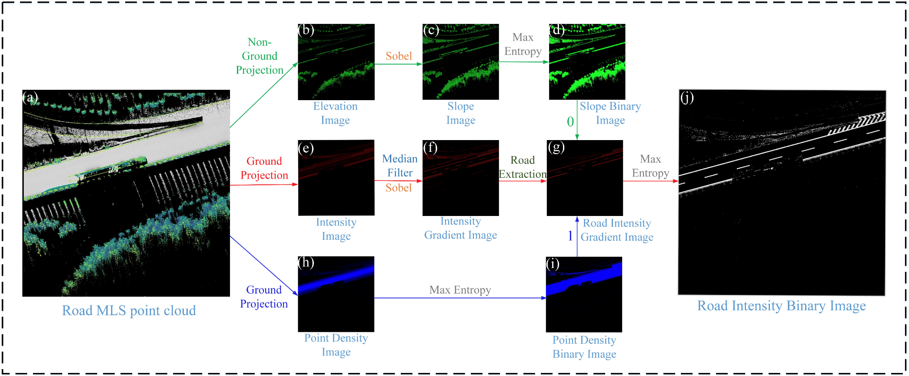
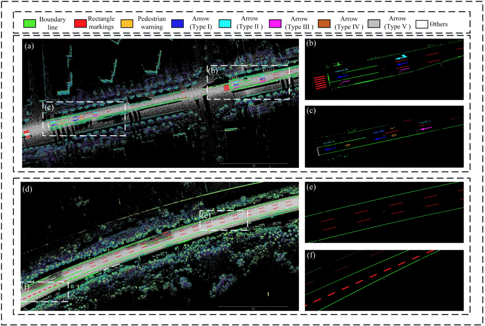

# RoadMarkingExtraction
This repository contains a C++ implementation of the automatic extraction, classification and vectorization of road markings from MLS point cloud. It's based on traditional image & point cloud processing approaches, which can act as the easy baseline for novel learning-based methods.


-------

## About
Version 1.2: passed on Ubuntu 16.04. For former versions, please check the other branches.

Dependent 3rd Party Libs: Eigen3, PCL1.8, OpenCV2, LibLas, DXFLib

Application Scenarios: MLS or ALS point cloud for highway or urban roads

## How to use
1. Install dependent libs by `sh ./script/download_dependent_lib.sh`.

2. Build the repository:

```
mkdir build
cd build
cmake .. 
make 
cd ..
```

3. Prepare the model pool (take `./model_pool/xxx` as an example) and configure the parameter list (take `./config/xxx.txt` as an example).

4. Configure the input (`*.las` or `*.pcd` point cloud) and output path in `./script/run_xxx.sh`.

5. Run `sh ./script/run_xxx.sh`. 

6. Check the results in your output folder. You may use CloudCompare to visualize the point cloud and use AutoCAD or [ShareCAD](https://beta.sharecad.org/) to visualize the dxf files.

------
### Citation

If you find this code useful for your work or use it in your project, please consider citing:

```
@article{pan2019automatic,
  title={Automatic Road Markings Extraction, Classification and Vectorization from Mobile Laser Scanning Data.},
  author={Pan, Yue and Yang, B and Li, S and Yang, H and Dong, Z and Yang, X},
  journal={International Archives of the Photogrammetry, Remote Sensing \& Spatial Information Sciences},
  year={2019}
}
```

[paper link](https://www.int-arch-photogramm-remote-sens-spatial-inf-sci.net/XLII-2-W13/1089/2019/)

### Workflow
 
### Image Processing
 
### Demo
 
 
### Acknowledgement:
Thanks [hibetterheyj](https://github.com/hibetterheyj) for the effort to migrate the codes on Linux.
